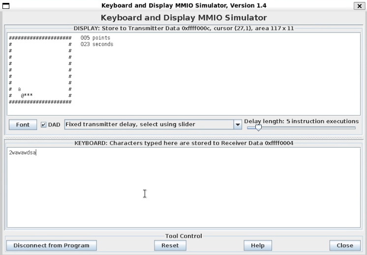

# Snake Game (RISC-V Assembly)

## Overview

This project implements a classic Snake game in RISC-V assembly, designed to run in the RARS simulator with support for keyboard and display MMIO. The game features real-time keyboard input, a timer, score tracking, and multiple difficulty levels.

## Problem Summary

The objective is to create an interactive Snake game where:
- The player controls a snake using the keyboard (WASD keys).
- The snake moves within a bounded grid, eats apples to grow and gain points, and the game ends if the snake hits a wall or time runs out.
- The game supports three difficulty levels, each with different starting times and bonus times for eating apples.
- The display and input are handled via the RARS Keyboard and Display MMIO Simulator.

## Screenshot


## Assumptions

- The program is run in the [RARS](https://github.com/TheThirdOne/rars) simulator.
- The Keyboard and Display MMIO Simulator tool is required for input/output.
- The user interacts with the game using the keyboard:  
  - `W` = up, `A` = left, `S` = down, `D` = right  
  - `1`, `2`, or `3` to select the difficulty at the start.
- The display grid is 10 rows by 20 columns.

## How to Run

1. Open RARS and load both [`common.s`](common.s) and [`snake.s`](snake.s).
2. Assemble the program.
3. Open the "Keyboard and Display MMIO Simulator" tool in RARS.
4. Click "Connect to Program" in the MMIO Simulator.
5. Run the program.

## File Descriptions

- **[snake.s](snake.s)**  
  Main implementation of the Snake game, including game logic, input handling, rendering, and timer/interrupt management.

- **[common.s](common.s)**  
  Sets up global variables, initializes the random number generator, and jumps to the main game routine.

- **[Code Examples/displayDemo.s](Code%20Examples/displayDemo.s)**  
  Example code demonstrating how to print characters and strings to the MMIO display.

- **[Code Examples/README.md](Code%20Examples/README.md)**  
  Instructions for running the display demo example.

---

**Console command to run the game in RARS:**

```
# Open RARS, load both files, assemble, and run with the MMIO Simulator tool enabled.
```